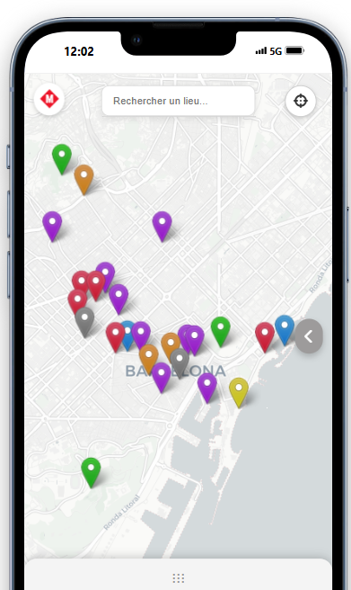

# Barcelone Map / Itinéraires

**Une webapp/mobile-web pour explorer, planifier et vivre un séjour à Barcelone, en centralisant tous les lieux, parcours et outils utiles sur une carte interactive.**

---

## 🚀 Objectif du projet

Barcelone Map permet de :

* Découvrir la ville et ses quartiers via une carte interactive avec tous les points d’intérêt (POI) : monuments, parcs, restaurants, hôtels, plages…
* Filtrer et organiser facilement les lieux par catégories ou favoris.
* Afficher des itinéraires “clés en main” pour chaque jour (ex : itinéraire du dimanche).
* Synthétiser tout le programme du séjour, accessible et éditable.
* Accéder rapidement aux lignes de métro/transport et à des infos pratiques.
* Être utilisé comme **compagnon de voyage** sur mobile, y compris **offline**.

---

## 🖥️ Stack & Structure technique

* **HTML / CSS / JS pur** (aucun framework, pour portabilité et usage offline).
* **Leaflet.js** pour la cartographie interactive.
* **Données** :

  * `barcelone.geojson` : tous les POI avec coordonnées, catégories, descriptions, horaires, etc.
  * `trajet.json` : distances et temps (à pied, en voiture) entre chaque étape d’un parcours.
* **Stockage local** : gestion des favoris via `localStorage`.
* **Découpage par page** (un JS/CSS par page principale).
* **Responsive** : design mobile-first, compatible desktop et tablette.
* **Aucune authentification “serveur”** (mini-login local pour accès à certaines pages).

---

## 🗂️ Pages principales

### `index.html` — **Carte principale**

* Carte Leaflet affichant tous les POI.
* **Filtres avancés** par catégories : hôtels, restaurants, monuments, quartiers, plages, favoris, etc. (checkbox et sélection rapide).
* **Recherche rapide** de lieux (auto-complétion).
* **Popups enrichis** sur chaque marker (nom, description, horaires, prix...).
* **Gestion des favoris** (ajout/retrait, liste dédiée).
* **Géolocalisation utilisateur** (bouton “Me localiser”).
* **Menu mobile latéral** : navigation rapide vers les autres sections.
* **Export PDF** du plan ou du programme (optionnel).
* **Mode offline partiel** si les fichiers sont préchargés.

### `itineraire/itinéraire.html` — **Itinéraire du dimanche**

* Affiche le parcours du jour (liste d’étapes enchaînées).
* **Carte filtrée** : seuls les points de l’itinéraire sont affichés.
* **Segments de parcours colorés** (polyline multicolore, chaque étape a sa couleur).
* **Tableau récapitulatif** : étapes, distances, durées (calculées avec `trajet.json`).
* **Panel coulissant (responsive)** : détail du parcours, légende des couleurs.
* **Affichage du total (km et temps).**

### `programme.html` — **Programme du séjour**

* Synthèse de toutes les activités/visites/repas du séjour.

### `infos.html` — **Infos pratiques**

* Page “Infos pratiques” (adresse de l’hôtel, transports, horaires, sécurité…).
* **Accès protégé** par un mini-login local (pas de vraie sécurité).

### `métro/metro-lignes.html`

* Carte/schéma rapide des lignes de métro de Barcelone.

---

## 📁 Structure des fichiers

```
/
│
├─ index.html
├─ style.css
├─ responsive.css
├─ script.js
├─ barcelone.geojson
├─ trajet.json
│
├─ itineraire/
│   ├─ itinéraire.html
│   ├─ script.js
│   ├─ style.css
│
├─ programme.html
│
├─ infos/
│   ├─ info.html
│   ├─ info.css
│
├─ métro/
│   ├─ metro-lignes.html
│   ├─ metro.css
│   ├─ image.png
│   ├─ lignes.js
│
├─ icons/
│   ├─ favicon.ico
│   ├─ ...
│
├─ manifest.json
├─ ...
```

---

## 🔥 Fonctionnalités principales

* **Chargement dynamique** des POI depuis GeoJSON.
* **Affichage conditionnel** des markers selon filtres, catégories, ou itinéraire.
* **Gestion avancée des filtres** (un clic sur la catégorie isole, “tout sélectionner/désélectionner”).
* **Calculs de distance/durée** pour chaque étape d’un parcours (données importées).
* **Panel itinéraire coulissant, full responsive**.
* **Menu latéral mobile rétractable** pour accès rapide aux autres pages.
* **Stockage local** des favoris.
* **Affichage géolocalisation de l’utilisateur** (si autorisé).
* **Affichage des segments colorés** sur la carte pour les parcours.
* **Popups détaillés** selon le lieu.
* **Design épuré, mobile-first**.

---

## 💡 Idées d’évolution & améliorations possibles

* Mode offline complet (cache des données pour usage sans réseau).
* Personnalisation d’itinéraires (création/édition par l’utilisateur).
* Ajout de notes/commentaires sur chaque lieu (stockés localement).
* Ajout d’un calendrier ou journal de voyage.
* Partage facile d’un parcours ou d’une sélection de POI.
* Affichage temps réel des horaires d’ouverture/fermeture via API.
* Calcul dynamique d’itinéraire avec estimation live (API externe).
* Affichage des lignes de métro/bus directement sur la carte.
* Mode nuit / dark mode automatique.
* Interface multilingue (FR/EN/ES…).
* Export PDF des parcours ou du programme.
* Accessibilité améliorée.
* Mini-profil utilisateur (avec favoris, parcours réalisés…).

---

## ✅ Ce qui fonctionne déjà

* Carte et filtres ultra-rapides et intuitifs.
* Ajout/retrait de favoris.
* Recherche et navigation très claires.
* Affichage des itinéraires par jour (parcours, couleurs, popups, totaux…).
* Responsive (mobile / desktop).
* Utilisable en offline partiel (si fichiers préchargés).
* Structure claire, facile à maintenir et à faire évoluer.

---

## 🔒 Authentification (Infos pratiques)

* La page `infos.html` est protégée par un mini-formulaire de connexion **local** (identifiant/mot de passe en JS côté client).
* ⚠️ **Ce système n’est pas sécurisé !**
  Il ne protège pas les infos sensibles : tout est accessible côté navigateur (voir [FAQ sécurité](#sécurité--limitations)).

---

## 🛠️ Installation & usage

1. **Cloner le repo ou ouvrir en local** :

   ```sh
   git clone https://github.com/RomainMarcelli/itin-raireBarcelone.git
   cd itin-raireBarcelone
   ```

2. **Ouvrir `index.html` dans ton navigateur** (tout fonctionne sans serveur).

3. **Pour utiliser les fonctionnalités offline :**

   * Précharge les fichiers de données (`barcelone.geojson`, `trajet.json`).
   * (PWA possible via manifest, à activer).

---

## 📷 Captures d’écran

*

---

## ⚠️ Sécurité & Limitations

* **Aucune sécurité sur l’authentification** : le “mot de passe” est visible dans le code JavaScript, il ne protège que contre l’accès accidentel.
* **Ne pas utiliser pour des infos sensibles ou des données personnelles**.
* Pour une vraie sécurité : il faut un backend (PHP, Node.js, Python…) qui gère les accès côté serveur.
* **Fichiers .env ou config.js ne protègent rien sur le web côté client** : tout est public.

---

## 👩‍💻 Auteur & contact

* Projet réalisé par *Romain Marcelli* dans le cadre d’un séminaire.

---
